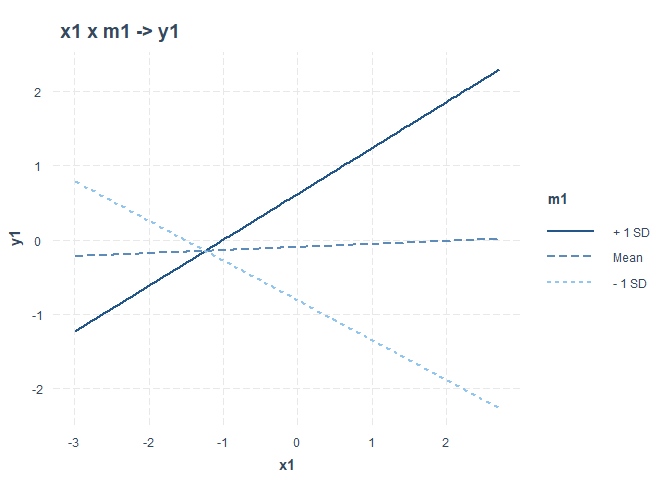

<!-- README.md is generated from README.Rmd. Please edit that file -->

# medmodr Package: Iterated Moderation and Mediation at Scale

<!-- badges: start -->

[](https://github.com/tosmartak/medmodr/actions/workflows/R-CMD-check.yaml)
<!-- badges: end -->

`medmodr` helps you systematically sweep through combinations of
variables to detect:

- **Moderation**: does a moderator change the effect of a predictor on
  an outcome?
- **Mediation**: does a mediator transmit the effect of a treatment to
  an outcome?

Instead of fitting models one by one, medmodr iterates across your
variable sets and returns tidy summary tables you can filter, rank, and
plot.

## Installation

`medmodr` requires `R >= 4.1.0`.

You can install the released version of **medmodr** from CRAN with:

``` r
install.packages("medmodr")
```

And you can install the development version from GitHub with:

``` r
# install.packages("pak")
pak::pak("tosmartak/medmodr")
# or alternatively:
# devtools::install_github("tosmartak/medmodr")
```

## Quick Start

Load the package and access the demo dataset included:

``` r
library(medmodr)
```

## Load Dataset

Below we simulate a small dataset and run one moderation and one
mediation analysis.

``` r
data("demo_medmodr")
demo <- demo_medmodr
head(demo)
#>           x1         x2         m1         m2         c1         c2     grp
#> 1  1.3709584 -2.0009292  2.4316793 -1.4490405  0.6888078  2.3250585   treat
#> 2 -0.5646982  0.3337772 -1.3210303  0.6225867  0.7250830  0.5241222 control
#> 3  0.3631284  1.1713251  0.3459897  1.6904484  0.2173802  0.9707334 control
#> 4  0.6328626  2.0595392  0.5553570  2.0712917 -0.2016567  0.3769734   treat
#> 5  0.4042683 -1.3768616 -0.2549411 -1.4866388 -1.3656899 -0.9959334   treat
#> 6 -0.1061245 -1.1508556 -1.0836383  0.8735562 -0.3089376 -0.5974829 control
#>         edu         y1         y2
#> 1  tertiary  4.4866832 -0.5296494
#> 2  tertiary  0.3903687  1.0376276
#> 3 secondary  0.3218529  0.6648226
#> 4  tertiary  2.0106726  3.1052683
#> 5   primary  0.2309061 -0.5248641
#> 6 secondary -0.7814729  0.2024834
```

**What each variable represents (for this README)**

- Treatments / Predictors: x1, x2 (numeric); grp (binary factor)
- Mediators: m1, m2 (numeric)
- Moderators: m1, m2, grp, edu (some numeric, some categorical)
- Outcomes: y1, y2 (numeric)
- Controls: c1, c2, edu (as covariates; can mix numeric and categorical)

This mirrors a realistic workflow where you scan multiple candidates at
once.

### Moderation example

`run_moderation_paths()` loops over all
`(predictor, moderator, outcome)` combinations and fits `lm()` with the
interaction term. It returns one row per interaction term (or a summary
row for categorical interactions if requested).

Below we intentionally pass `multiple variables` to each argument. Set
plot_sig = FALSE here to keep knitting fast; you can enable plots in
your own analysis by setting plot_sig = TRUE

``` r
mod_summary <- run_moderation_paths(
  data = demo,
  predictors = c("x1", "x2"),
  moderators = c("m1", "grp", "edu"), # mix of numeric and categorical
  outcomes = c("y1", "y2"),
  controls = c("c1", "c2"),
  categorical_vars = c("grp", "edu"),
  sig_level = 0.05,
  plot_sig = TRUE, # set TRUE in your analysis to auto-plot significant interactions using the interaction package
  summarize_categorical = TRUE # summarize multiple dummy-by-interaction lines into a single row per categorical mod
)
```



The resulting dataset from our moderation analysis is shown below:

``` r
head(mod_summary)
#>                     Predictor Moderator Outcome        Term Interaction_Effect
#> ...1                       x1        m1      y1       x1:m1         0.45629168
#> ...2                       x1        m1      y2       x1:m1         0.05046883
#> ...3                       x1       grp      y1 x1:grptreat        -0.48947937
#> ...4                       x1       grp      y2 x1:grptreat         0.09836911
#> x1:edusecondary...5        x1       edu      y1     Summary         0.21949221
#> x1:edusecondary...6        x1       edu      y2     Summary        -0.30761754
#>                      Std_Error    T_value      P_value    CI_Lower   CI_Upper
#> ...1                0.04986050  9.1513655 7.861975e-17  0.35856509  0.5540183
#> ...2                0.06870741  0.7345471 4.635023e-01 -0.08419769  0.1851354
#> ...3                0.18690712 -2.6188375 9.520050e-03 -0.85581732 -0.1231414
#> ...4                0.19796611  0.4968987 6.198231e-01 -0.28964446  0.4863827
#> x1:edusecondary...5 0.24112499  0.9102839 3.638141e-01 -0.25311277  0.6920972
#> x1:edusecondary...6 0.25088759 -1.2261170 2.216563e-01 -0.79935721  0.1841221
#>                     Has_Moderation
#> ...1                          TRUE
#> ...2                         FALSE
#> ...3                          TRUE
#> ...4                         FALSE
#> x1:edusecondary...5          FALSE
#> x1:edusecondary...6          FALSE
```

**What to look at:**

- `Term` is the specific interaction term (or a summary label for
  categorical moderators)

- `Interaction_Effect`, `Std_Error`, `T_value`, `P_value`, `CI_Lower`,
  `CI_Upper`

- `Has_Moderation` indicates significance at `sig_level`

### Mediation example

`run_mediation_paths()` loops over all `(treatment, mediator, outcome)`
triples. For each triple it fits the two linear models and calls
`mediation::mediate()` to estimate
`ACME, ADE, Total Effect, and Proportion Mediated with 95% CIs`.

We pass **multiple treatments, mediators, and outcomes**. For speed in
documentation, we use `sims = 200` and `boot = FALSE`. In real analysis,
increase sims (e.g., 1000–5000) and consider boot = TRUE.

``` r
med_summary <- run_mediation_paths(
  data = demo,
  treatments = c("x1", "x2"), # you can also include "grp" if you want to treat it as a treatment
  mediators = c("m1", "m2"),
  outcomes = c("y1", "y2"),
  controls = c("c1", "c2", "edu"),
  sims = 200, boot = FALSE, seed = 1
)
head(med_summary)
#> # A tibble: 6 × 20
#>   Treatment Mediator Outcome     ACME ACME_CI_Lower ACME_CI_Upper ACME_p     ADE
#>   <chr>     <chr>    <chr>      <dbl>         <dbl>         <dbl>  <dbl>   <dbl>
#> 1 x1        m1       y1       4.05e-1        0.273         0.528    0     0.0490
#> 2 x1        m1       y2       8.71e-2       -0.0338        0.196    0.16 -0.109 
#> 3 x2        m1       y1       2.42e-3       -0.128         0.102    0.91  0.0417
#> 4 x2        m1       y2      -1.29e-4       -0.0224        0.0152   0.93  0.708 
#> 5 x1        m2       y1      -8.39e-3       -0.0395        0.0139   0.48  0.463 
#> 6 x1        m2       y2      -7.44e-2       -0.205         0.0185   0.12  0.0516
#> # ℹ 12 more variables: ADE_CI_Lower <dbl>, ADE_CI_Upper <dbl>, ADE_p <dbl>,
#> #   Total_Effect <dbl>, Total_Effect_CI_Lower <dbl>,
#> #   Total_Effect_CI_Upper <dbl>, Total_Effect_p <dbl>, Prop_Mediated <dbl>,
#> #   PropMediated_CI_Lower <dbl>, PropMediated_CI_Upper <dbl>,
#> #   PropMediated_p <dbl>, Has_Mediation <lgl>
```

#### Visual summaries for mediation

These plots are fast for small tables but can be heavy on large scans,
so we kept most of them eval=FALSE in README. Use them interactively in
your analysis.

**Effect overview plot (ACME, ADE, Total Effect with CIs):**

By default, it would generate a summary grid plot for significant
mediations only

``` r
plot_mediation_summary_effects(med_summary, filter_significant = TRUE, summary_plot = TRUE)
```


**You can also show only ACME plots from significant results**

``` r
plot_mediation_summary_effects(med_summary, filter_significant = TRUE, show_only_acme = TRUE, summary_plot = TRUE)
```

**You can equally loop over all significant mediation triples and plot
each**

``` r
plot_mediation_summary_effects(med_summary, filter_significant = TRUE, summary_plot = FALSE)
```

**You can also show only ACME for single plots**

``` r
plot_mediation_summary_effects(med_summary, filter_significant = TRUE, summary_plot = FALSE, show_only_acme = TRUE)
```

## Learn more

Browse the vignettes for detailed workflow

- Topics covered in vignettes:

  - How to prepare your dataset

  - Detailed moderation and mediation workflows

  - Plotting significant results

  - Performance and reproducibility tips

## Function reference (quick)

- `run_moderation_paths(data, predictors, moderators, outcomes, controls, categorical_vars = NULL, sig_level = 0.05, plot_sig = FALSE, summarize_categorical = FALSE)`
  — loop over predictors × moderators × outcomes

- `run_mediation_paths(data, treatments, mediators, outcomes, controls, sims = 1000, boot = TRUE, seed = 123)`
  — loop over treatments × mediators × outcomes

- `plot_mediation_summary_effects(summary_table, filter_significant = FALSE, show_only_acme = FALSE)`
  — visualize significant mediation results

## License and issues

- MIT license

- Please file issues and feature requests on GitHub

- Contributions welcome (add tests where possible)
